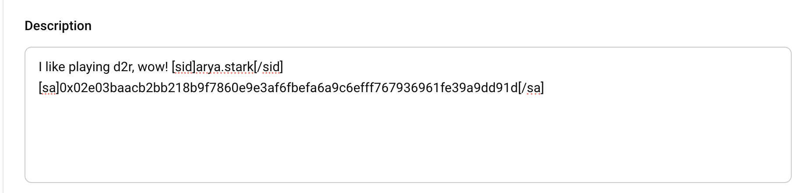
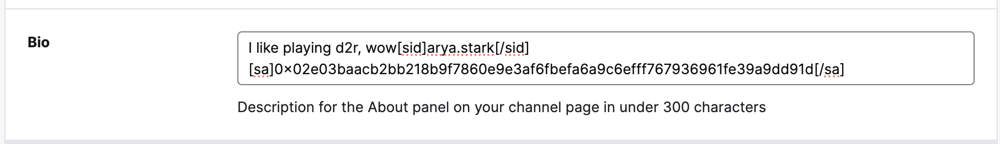

# Arya 🤖

Arya is a generative AI agent package created using [Eliza](https://elizaos.github.io/eliza/) framework.
The main goal of Arya is for the community to send rewards to streamer/content creator via AI agent.

As a part of Eliza framework, this project retains all existing packages from Eliza. You can find Arya plugin code in [packages > plugin-arya](https://github.com/0xbohu/arya/tree/main/packages/plugin-arya)

Arya character file can be found in [arya.character.json](https://github.com/0xbohu/arya/blob/main/characters/arya.character.json)

## ✨ Features

All the features are tested on Starknet Mainnet

- 👥 Integration with Twitch and Youtube for creator search
- 💾 Extract creator Starknet address and Starknet ID from description
- 🔗 Integrate with Starknet ID
- 🚀 Support AVNU Token Price query and token-to-token swap
- ☁️ Supports Token Sending on Starknet
- ✨ Support Web UI and Telegram Integration

## Video Tutorials

- [Arya Web Agent Walk Through Demo](https://youtu.be/PuMhW_PaKYc)
- [Arya Telegram Bot Walk Through Demo](https://youtu.be/_fRebdILMxs)

Check transaction during the walkthrough video

Transfer [tx](https://voyager.online/tx/0x31e8cd943d3fda9caaa0010756318b4ecb9e4cec4e4a374825c4ce264a355c7)

Swap [tx](https://voyager.online/tx/0x051a05ddb15a32519ba4bb02167f30c6f115f582a995e7b744ff9cfb3379a33f)

## 🚀 Quick Start

### Prerequisites

- [Python 2.7+](https://www.python.org/downloads/)
- [Node.js 23+](https://docs.npmjs.com/downloading-and-installing-node-js-and-npm)
- [pnpm](https://pnpm.io/installation)

### Environment

use `.env.example` to prepare your own `.env` (this is added in .gitignore)
Modify below entries with your own credentials

```
# AI Model API Keys
OPENAI_API_KEY=
SMALL_OPENAI_MODEL=   #recommend gpt-4o-mini

# Starknet Configuration
STARKNET_ADDRESS= # Your Starknet Mainnet Wallet Address
STARKNET_PRIVATE_KEY= # Your Starknet Mainnet Wallet Privatekey
STARKNET_RPC_URL=    #recommend https://1rpc.io/starknet

#Twitch
TWITCH_CLIENT_ID= # Your Twitch Client ID
TWITCH_CLIENT_SECRET=  # Your Twitch Client Secret
TWITCH_ACCESS_TOKEN=  # Your Twitch Access Token if already authenicated, last for 60 days

#Youtube
YOUTUBE_API_KEY= # Your youtube API v3 API key

# Telegram Configuration
TELEGRAM_BOT_TOKEN= # you can deploy your own telegram bot by interact with Telgram official bot @BotFather, then update this BOT token config

```

### Streamer/Content Creator

Content Creator can norminate their Starknet Address and/or Starknet ID in their streaming platform Bio/Description area
this allows Arya to query and extract their Starkent details so community users can send tokens to reward their favourite content creator

Streamer can setup either Starkent Id or Starkent Address, or both

Example to set Starkent ID

```
[sid]arya.stark[sid]
```

Example to set Starkent Address

```
[sa]0x02e03baacb2bb218b9f7860e9e3af6fbefa6a9c6efff767936961fe39a9dd91d[sa]

```

Youtube > Set Channel Description



Twitch > Set Profile Bio



### Start Eliza

```bash
pnpm i && pnpm build && pnpm start
```

Once the agent is running, You should see the message to run "pnpm start:client" at the end.
Open another terminal and move to same directory and then run below command and follow the URL to chat to your agent.

```bash
pnpm start:client
```

Read the [Documentation](https://elizaos.github.io/eliza/) to learn how to customize your Eliza.

#### Making changes and Build Arya

```bash
cd packages/plugin-arya
pnpm build

```
